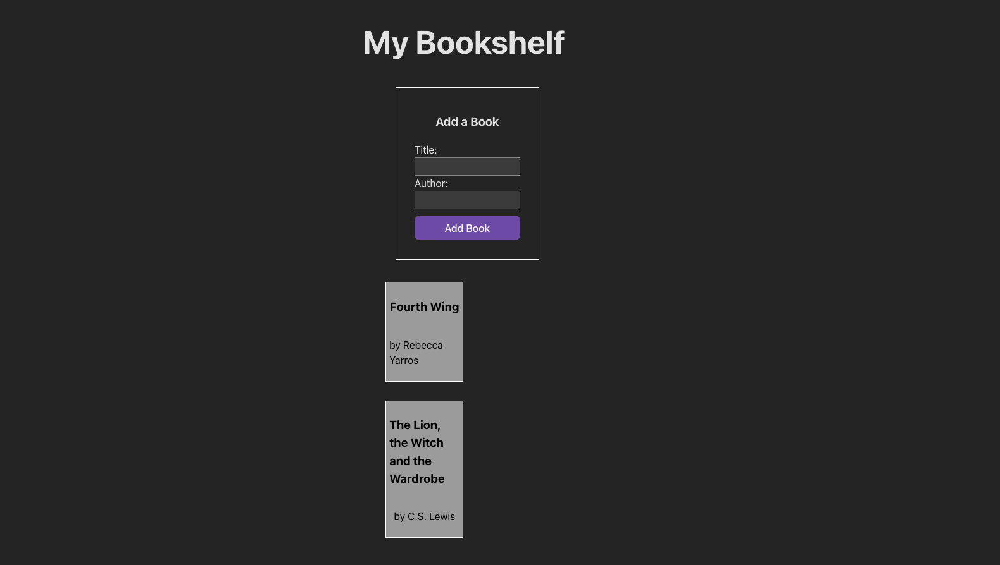

<h1>
  
  Controlled Forms in React Lab
</h1>

## About

Welcome to Reactville, a constantly evolving virtual metropolis. Let's build this digital town together, one component at a time.

The local library is adding a feature to its website where users can add their favorite books to a virtual bookshelf. In this lab, you will help build the front-end UI to make it happen!

You will develop a single component named `BookShelf` that contains both the controlled form and the display of the bookshelf. Using the `useState` hook, you will manage the form inputs and list of books, enabling real-time updates to the UI based on user input.

By the end of this lab, you'll have a functional application where users can add books to a personalized bookshelf, with each new entry updating the display immediately—no page reloads required!

## Content

- [Setup](./setup/README.md)
- [Exercise](./exercise/README.md)

## Internal

### Prerequisites

- Controlled Forms in React

### Time to complete

Estimated time to complete core lab exercise: **90 min**

### Solution code

🏁 [Solution code](https://git.generalassemb.ly/modular-curriculum-all-courses/controlled-forms-in-react-lab-solution)

### Course landing pages

- [RDS - React Development Short Course](https://pages.git.generalassemb.ly/modular-curriculum-all-courses/controlled-forms-in-react-lab/canvas-landing-pages/rds.html)
- [SEB - Software Engineering Bootcamp](https://pages.git.generalassemb.ly/modular-curriculum-all-courses/controlled-forms-in-react-lab/canvas-landing-pages/seb.html)
- [Fallback](https://pages.git.generalassemb.ly/modular-curriculum-all-courses/controlled-forms-in-react-lab/canvas-landing-pages/fallback.html)

### Resources

✏️ [Instructor Guide](./internal-resources/instructor-guide.md)

🎥 [Video Hub](./internal-resources/video-hub.md)

🏗️ [Release Notes](./internal-resources/release-notes.md)

---

**Find a 👾 bug 👾 or have suggestions? [Let us know](https://pages.git.generalassemb.ly/modular-curriculum-all-courses/universal-resources-internal/module-feedback.html)!**
